# SignAI – AI-Powered Sign Language Translation

> Real-time sign language to speech translation using AI. Breaking communication barriers for 466M people worldwide.

**[Watch Demo →](https://www.youtube.com/watch?v=mUqhuTOU_BI)**

---

## What It Does

SignAI translates hand gestures into spoken sentences in real-time using Google's MediaPipe AI. Built for deaf and mute individuals to communicate with hearing people instantly.

**Key Features:**

- 9 ASL gestures → English sentences
- Smart sentence builder (combines gestures)
- Multilingual translation (6 languages)
- Text-to-speech output
- Conversation history & export
- 100% browser-based, no backend

---

## Supported Gestures

- **Hello** ✋ - Open palm
- **Yes** 👍 - Thumbs up
- **No** 👎 - Thumbs down
- **OK** 👌 - Thumb + index circle
- **Stop** ✊ - Closed fist
- **Help** 🆘 - Four fingers up
- **You** 👉 - Pointing
- **Good** ✌️ - Peace sign
- **Thank you** 🤙 - Y-shape (thumb + pinky)

**Smart Combinations:**

- Hello + You → "Hello, how are you?"
- Help + You → "Do you need help?"
- Yes + Help → "Yes, I need help."

---

## Tech Stack

```mermaid
graph LR
    A[📹 Camera] --> B[🤖 MediaPipe AI]
    B --> C[🧠 Gesture Classifier]
    C --> D[📝 Sentence Builder]
    D --> E[🌍 Translation]
    E --> F[🔊 Speech Output]

    style A fill:#4CAF50
    style B fill:#2196F3
    style C fill:#FF9800
    style D fill:#9C27B0
    style E fill:#F44336
    style F fill:#00BCD4
```



**Stack:**

- MediaPipe Hands (Google AI for hand tracking)
- JavaScript (gesture classification)
- MyMemory API (translation)
- Web Speech API (text-to-speech)

---

## Quick Setup

```bash
git clone https://github.com/YOUR_USERNAME/signai.git
cd signai
start index.html  # Windows
```

No installation needed. Just open `index.html` in your browser.

---

## Impact

**466 million people** worldwide have hearing loss. SignAI helps:

- Emergency communication
- Daily conversations
- Healthcare interactions
- Social inclusion

**Accessibility is not a feature. It's a fundamental human right.**
